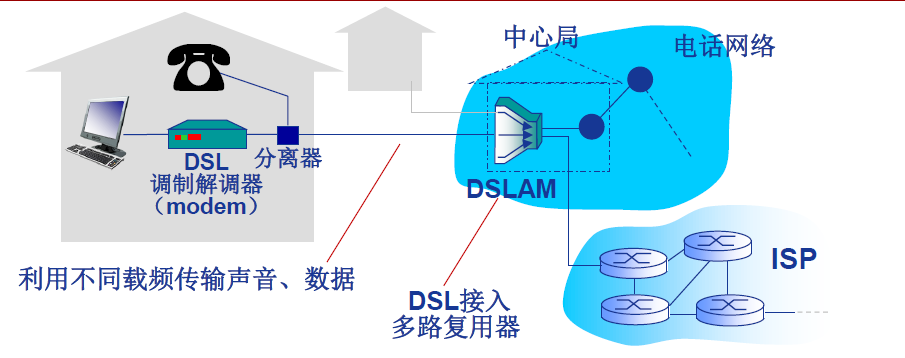

# 计算机网络概述

***

[toc]

***

## 什么是计算机网络？

### 计算机网络 = 通信技术 + 计算机技术

* 计算机网络是**通信技术**与**计算机技术**紧密结合的产物。

* 通信系统模型：

  信源（计算机）——》发送设备——》信道——》接收设备——》信宿（计算机）

* 计算机网络就是一种特殊的通信网络

### 计算机网络?

* 定义：计算机网络就是**互连**的、**自治**的计算机集合。

* **自治**-无主从关系

* **互连**-互联互通

  * 通信链路（信道）

    

* 距离远、数量大如何保证互连？

* 通过**交换网络**互连主机

  

### 什么是 Internet？- 组成细节角度

* 全球最大的**互联网络**

  * ISP（Internet Service Provider）网络互连的“网络之网络”

    

* 数以百万计的互连的**计算设备**集合：

    * **主机**（hosts）= **端系统**（end systems）
    * 运行各种网络应用
    
    
    
* 通信链路

    * 光纤，铜缆，无线电，卫星......

    

* 分组交换：转发分组（数据包）

    * **路由器**（routers）和**交换机**（switches）

    

### 什么是 Internet？- 服务角度

* 为网络应用提供通信服务的通信基础设施

    * Web，VoIP，email，网络游戏，电子商务，社交网络，...
* 为网络应用提供应用编程接口（API）：
    * 支持应用程序“连接”Internet，发送/接收数据
    * 提供类似于邮政系统的数据传输服务

### 问题

* Q：仅有硬件（主机、链路、路由器......）连接，Internet 能否顺畅运行？能保证应用数据有序交付吗？......
* A：No！
* 还需要协议！

***

## 什么是网络协议？

### 协议是计算机网络有序运行的重要保证

* 硬件（主机、路由器、通信链路等）是计算机网络的基础
* 计算机网络中的数据交换必须遵循事先约定好的**规则**
* 如同交通系统

### 任何通信或信息交换过程都需要规则

人类交谈：

* 询问时间
* 请教问题
* 人员引荐

... 发送特定消息

... 采取特定动作

* 网络通信：

  * 通信主题是“机器“而不是人
  * 交换 “电子化” 或 “数字化” 消息
  * 计算机网络的所有通信过程都必须遵守某种/些规则-协议

  

### 什么是网络协议？

* 网络协议（network protocol），简称为**协议**，是为进行网络中的数据交换而建立的规则、标准或约定

* **协议**规定了通信实体之间所交换的信息的**格式**、**意义**、**顺序**以及针对收到信息或发生的事件所采取的 “**动作**”（**action**）

### 协议三要素

* **语法**（Syntax）
  * 数据与控制信息的结构或格式
  * 信号电平
* **语义**（Semantics）
  * 需要发出何种控制信息
  * 完成何种动作以及做出何种响应
  * 差错控制
* **时序**（Timing）
  * 事件顺序
  * 速度匹配

### 协议是计算机网络的重要内容

* 协议规范了网络中所有信息发送和接收过程
  * e.g., TCP, IP, HTTP, Skype, 802.11
* 学习网络的重要内容之一
* 网络创新的表现形式之一
* Internet协议标准
  * RFC: Request for Comments
  * IETF：互联网工程任务组（Internet Engineering Task Force）

***

## 计算机网络的结构

### 计算机网络结构

* 网络边缘：
  * 主机
  * 网络应用
* 接入网络，物理介质：
  * 有线或无线通信链路
* 网络核心（核心网络)：
  * 互联的路由器（或分组转发设备）
  * 网络之网络

### 网络边缘

* 主机（端系统）：
  * 位于 ”网络边缘“
  * 运行网络应用程序
    * 如：Web，email
* 客户/服务器（client/server）应用模型：
  * 客户发送请求，接收服务器响应
  * 如：Web 应用，文件传输 FTP 应用

* 对等（peer-peer，P2P）应用模型：
  * 无（或不仅依赖）专用服务器
  * 通信在**对等**实体之间进行
  * 如：Gnutella，BT，Skype，QQ

### 接入网络

Q：如何将网络边缘接入核心网（边缘路由器）？

A：接入网络

 * 住宅（家庭）接入网络
 * 机构接入网络（学校，企业等）
 * 移动接入网络

用户关心是：

* 带宽（bandwidth）（bps）？
* 共享/独占？

### 接入网络：数字用户线路（DSL）

* 利用**已有的**电话线连接中心局的DSLAM

  * 数据通信通过 DSL 电话线接入 Internet
  * 语音（电话）通过 DSL 电话线接入电话网

* < 2.5 Mbps 上行传输速率（典型速率 < 1 Mbps）

* < 24 Mbps 下行传输速率（典型速率 < 10）

* FDM：

  * \> 50 kHz - 1 MHz 用于下行
  * 4 kHz - 50 kHz 用于上行
  * 0 kHz - 4 kHz 用于传统电话

### 接入网络：电缆网络

**频分多路复用**：在不同频带（载波）上传输不同频道

* HFC：混合光纤同轴电缆（hubrid fiber coax）
  * 非对称：下行高达 30 Mbps 传输速率，上行为 2 Mbps 传输速率
* 各家庭（设备）通过电缆网络—》光纤接入 ISP 路由器
  * 各家庭**共享**家庭至电缆头端的**接入网络**
  * 不同于 DSL 的**独占**至中心局的接入

### 典型的家庭网络的接入

### 机构（企业）接入网络（Ethernet）

* 主要用于公司、高校、企业等组织机构
* 典型传输速率：10 Mbps，100 Mbps，1 Gbps，10 Gbps
* 目前，端系统通常直接连接以太网交换机（switch）

### 无线接入网络

* 通过**共享**的**无线接入网络**连接端系统与路由器

  * 通过**基站**（base station）或称为 ”**接入点**“（assess point）

* 无线局域网（LANs）：

  * 同一建筑物内（30m）
  * 802.11b/g（WiFi）：11 Mbps、54 Mbps 传输速率

  

* 广域无线接入：

  * 通过电信运营商（蜂窝网），接入范围在几十公里~
  * 带宽：1 Mbps、10 Mbps、100 Mbps
  * 3G、4G：LTE
  * 移动互联网

  

### 网络核心

* 互联网的路由器网络
* 网络核心的关键功能：**路由**+**转发**

**路由（routing）：**确定分组从源到目的传输路径

* 路由算法

**转发（forwarding）：**

* 将分组从路由器的输入端口交换至正确的输出端口

网络核心解决的基本问题：

* Q：如何实现数据从源主机通过网络核心送达目的主机？
* A：数据交换

***

## Internet 结构

### Internet 结构：网络之网络

* 端系统通过**接入 ISP（access ISPs）**连接到 Internet
  * 家庭、公司和大学 ISPs
* 接入 ISP 必须进一步互连
  * 这样任意两个主机才可以互相发送分组
* 构成复杂的网络互连的网络
  * 经济和国家政策是网络演进的主要驱动力
* 当前 Internet 结构？
  * 无人能给出精确描述

Q：数以百万计的接入 ISP 是如何互连在一起的呢？

可选方案：每个接入 ISP 直接彼此互连？

可选方案：将每个接入 ISP 连接到一个国家或全球 ISP（Global ISP）？

但是从商业角度，必定有竞争者...

这些 ISP 网络必须互连

... 可能出现**区域网络（regional networks）**连接接入 ISP 和运营商 ISP

... **内容提供商网络**（content provider networks，如 Google，Microsoft 等）可能运行其自己的网络，就近为端用户提供服务、内容

* 在网络中心：少数互连的大型网络
  * **”一级“（tier-1）商业 ISPs**（如：网通、电信、Sprint、AT&T），提供国家或国际范围的覆盖
  * **内容提供商网络**（content provider network，如：Google）：私有网络，连接其数据中心与 Internet，通常绕过一级 ISP 和区域 ISPs

***

## 数据交换-电路交换

### 网络核心

* 互联网的路由器网络
* Q：如恶化实现数据通过网络核心从源主机到达目的主机？
* A：数据交换

### 为什么需要数据交换

* N^2链路问题
* 连通性
* 网络规模

### 交换?

* 动态转接

  

* 动态分配传输资源

  

### 数据交换的类型

* 电路交换
* 报文交换
* 分组交换

### 电路交换的特点

* 最典型电路交换网络：电话网络
* 电路交换的三个阶段：
  * 建立连接（呼叫/电路建立）
  * 通信
  * 释放连接（拆除电路）
* 独占资源

### 电路交换网络的链路共享？

电路交换网络如何共享中继线？

——多路复用（Multiplexing）

***

## 多路复用

### 多路复用？

* 多路复用（multiplexing），简称**复用**，是通信技术中的基本概念

  

多路复用：
  链路/网络资源（如带宽）划分为 ”资源片“

* 将资源片分配给各路 “呼叫”（calls）

* 每路呼叫**独占**分配到的资源片进行通信

* 资源片可能 “**闲置**”（idle）（无共享）

典型多路复用方法：

* 频分多路复用（frequency division multiplexing-FDM）
* 时分多路复用（time division multiplexing-TDM）
* 波分多路复用（Wavelength division multiplexing-WDM）
* 码分多路复用（Code division multiplexing-CDM）

### 频分多路复用 FDM

* **频分多路复用**的各用户占用不同的带宽资源（请注意，这里的 ”带宽“ 是**频率带宽（单位：Hz）**而不是数据的发送速率）

* 用户在分配到一定的频带后，在通信过程中自始至终都占用这个频带

  

### 时分多路复用 TDM

* **时分复用**则是将时间划分为一段段等长的**时分复用帧**（TDM 帧），每个用户在每个 TDM 帧中占用固定序号的时隙

* 每用户所占用的时隙是**周期性出现**（其周期就是 TDM 帧的长度）

  

* 时分复用的所有用户是在不同的时间占用**相同的**频带宽度

### 波分多路复用 WDM

* 波分复用就是光的频分复用

  

### 码分多路复用 CDM

* 广泛应用于无线链路共享（如蜂窝网，卫星通信等）

* 每个用户分配一个唯一的 m bit **码片序列**（chipping sequence），其中 ”0“ 用 ”**-1**“ 表示、”1“ 用 ”**1**“ 表示，例如:

  * S 站的码片序列：（-1-1-1+1+1-1+1+1）

* 个用户使用**相同频率**载波，利用各自码片序列编码数据

* **编码信号** =（原始数据）X （码片序列）
  * 比如发送比特 1（+1），则发送自己的 **m bit 码片序列**
  * 比如发送比特 0（-1），则发送该码片序列的 **m bit 码片序列的反码**

* 各用户码片序列相互**正交**（orthogonal）

  

***

## 数据交换—报文、分组交换（1）

### 报文交换（message switching）

* **报文**：源（应用）发送信息整体

  * 比如：一个文件

    

### 分组交换（package switching）

* **分组**：报文分拆出来的一系列相对小的数据包

* 分组交换需要报文的**拆分**与**重组**

* 产生**额外开销**

  

### 分组交换：统计多路复用（Statistical Multiplexing）

A & B 分组序列不确定，按需共享链路

### 存储-转发（store-and-forward）

* **报文交换**与**分组交换**均采用**存储-转发**交换方式
* 区别：
  * 报文交换以完整**报文**进行 “存储-转发”
  * 分组交换以较小的**分组**进行 “存储-转发”
* 那种交换更好呢？

## 数据交换—报文、分组交换（2）

### 分组交换：传输延迟

发送主机:

* 接收应用报文（消息）

* 拆分为较小长度为 L bits 的分组（packets）

* 在传输速率为 R 的链路上传输分组

  

### 报文交换 vs 分组交换？

* 报文交换:
  * 报文长度为 M bits
  * 链路带宽为 R bps
  * 每次传输报文需要 M/R 秒
* 分组交换
  * 报文被拆分为多个分组
  * 分组长度为 L bits
  * 每个分组传输时延为 L/R 秒

例：

* M = 7.5 Mbits，L = 1500 bits
  * M = 5000 L
* R = 1.5 Mbps
* 报文交换：
  * 报文交付时间 = ？sec
* 分组交换
  * 报文交付时间 = ？sec

例：

* M = 7.5 Mbits，L = 1500 bits
  * M = 5000 L
* R = 1.5 Mbps
* 报文交换：
* 报文交付时间 = **15** s
* 路由器至少需要多大缓存？

例：

* M = 7.5Mbits，L = 1500bits
   * M = 5000L
* R = 1.5 Mbps
* 分组交换：
  * 报文交换时间 = 5002 ms = 5.002 sec
* 路由器至少需要多大缓存？

### 分组交换的报文交付时间

* 报文：M bits

* 链路带宽（数据传输速率）：R bps

* 分组长度（大小）：L bits

* 跳步数：h

* 路由器数：n

  

## 数据交换-报文、分组交换（3）

### 例题 1.1

* 如下图所示的采用 ”存储-转发“ 方式的分组交换网络中，所有链路的数据传输速率为 **100 Mbps**，分组大小为 **1000 B**，其中分组头大小为 **20 B**。若主机 H1 向主机 H2 发送一个大小为 **980 000 B **的文件，则在不考虑分组拆装时间和传播延迟的情况下，从 H1 发送开始到 H2 接收完为止，需要的时间**至少**是多少？

  

* 【解】980 000 B 大小的文件需要分**1000**个分组，每个分组**1000 B**。H1 发送整个文件需要的传输延迟为（980 000 + 20 * 1000）* 8/100 000 000 = 80 ms；根据路由选择基本原理，所有数据分组应该经过两个路由器的转发，所以**再加上最后一个分组的两次转发**的传输延迟，即 2 * 1000 * 8 / 100 000 000 = 0.16 ms。所以，H2 收完整个文件至少需要 80 + 0.16 = 80.16 ms。

### 分组交换 vs 电路交换？

* 例：
  * 1 Mb/s 链路
  * 每个用户:
    * ”活动“ 时需要 100 kb/s
    * 平均活动时间 10%
* 电路交换：
  * 10 用户
* 分组交换：
  * 对于 35 个用户，大于 10 个用户同时活动的概率 < 0.0004

分组交换允许更多用户同时使用网络！——网络资源充分共享

### 分组交换绝对由于电路交换？

* 适用于**突发**数据传输网络
  * 资源充分共享
  * 简单、无需呼叫建立
* 可能产生拥塞（congestion）：分组延迟和丢失
  * 需要协议处理可靠数据传输和拥塞控制
* Q：如何提高电路级性能保障？
  * 例如，音/视频应用所需的宽带保障